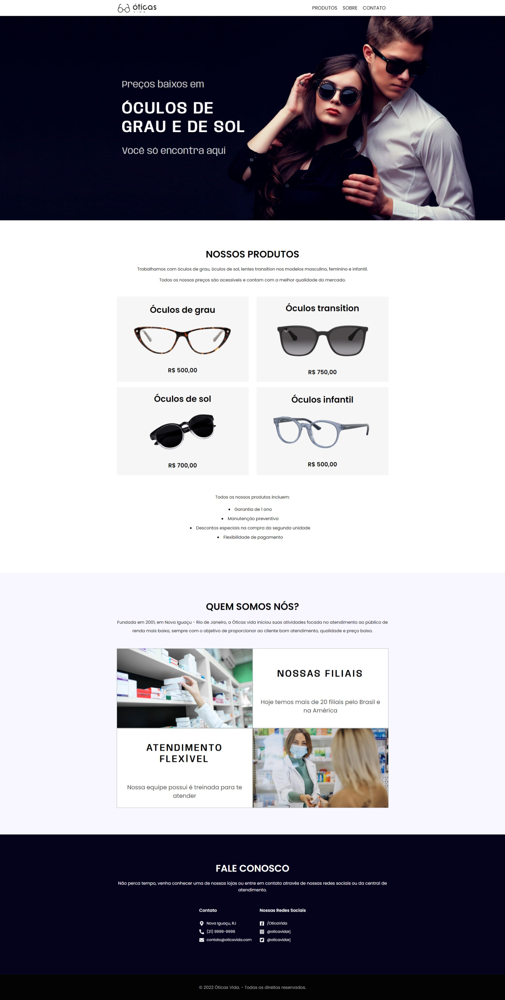
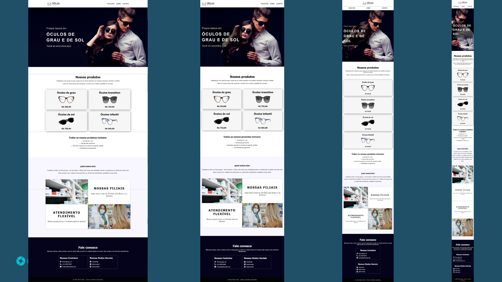

###Projeto missão 24 react DevMedia
----------------

### **Visão geral do projeto**

A proposta desse projeto é criar uma página web para uma loja de óculos em React, para que você coloque em prática os seguintes conceitos:

- Criar componentes;
- Importar e exportar componentes;
- Utilizar componentes nativos do React;
- Organizar o código da aplicação, dividindo-o em partes menores.

### **MiniMundo - Página Loja de Óculos**

O projeto que será criado é uma página para uma loja de óculos, onde é apresentado os produtos, as informações e os contatos da loja.

O objetivo é proporcionar aos clientes a navegação entre as seções da página, permitindo também a visualização dos produtos disponíveis para venda, informações sobre a loja e meios de contato, tais como endereço, número de telefone e redes sociais.

A página terá a seguinte estrutura:

- Topo;
- Seção Capa;
- Seção Produtos;
- Seção Sobre;
- Seção Contato;
- Rodapé.

### Responsividade do projeto

O projeto deverá ser responsivo, ou seja, se adaptar a diversas resoluções de tela.

